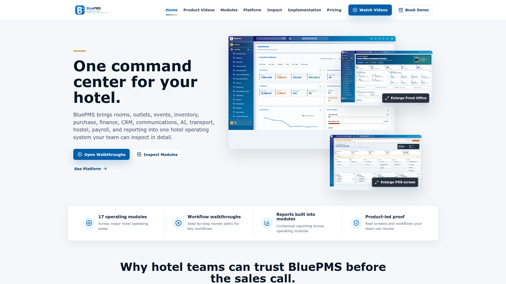
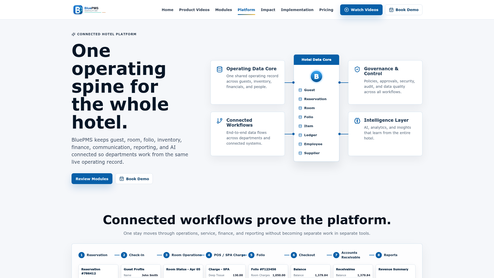
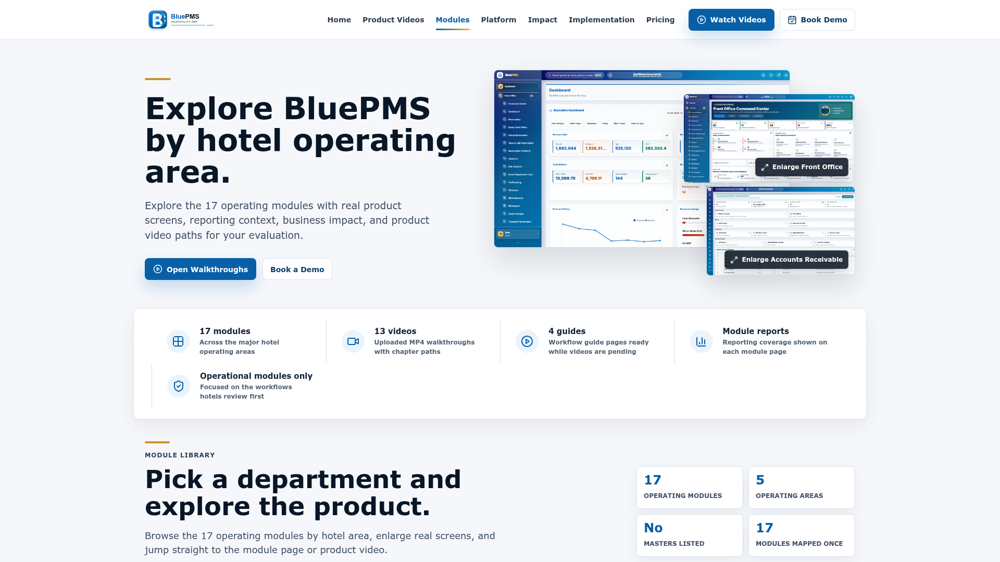
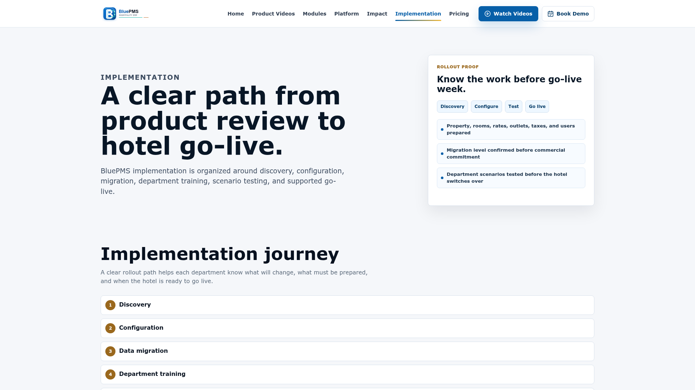
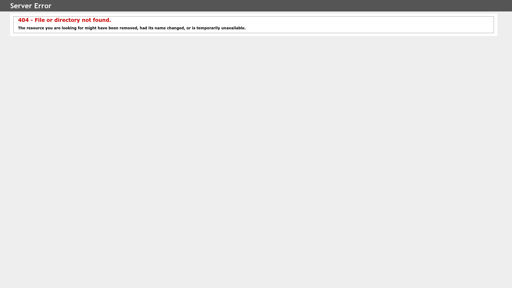
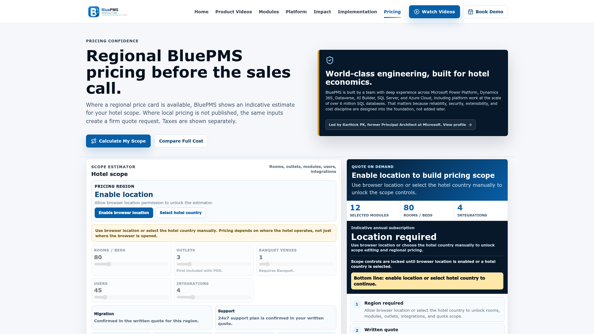
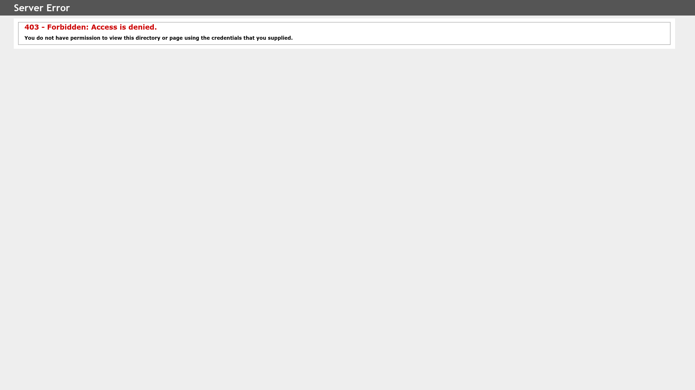

# BLUEPMS · Mobile Field Guide

### Property operations, translated for the small screen.

A mobile-first product experience for exploring the BLUEPMS hospitality platform—its modules, implementation model, commercial value, and operational impact.

---

## Check in

BLUEPMS Mobile packages a hospitality platform story into a native-feeling Expo application. Instead of shrinking a desktop website, it separates the product into focused routes that can be understood between front-desk tasks, property walkthroughs, and stakeholder conversations.

<table>
<tr>
<td width="50%"></td>
<td width="50%"></td>
</tr>
<tr>
<td align="center"><strong>Arrival</strong> Brand, value proposition, and the first path into the platform.</td>
<td align="center"><strong>Platform</strong> A compact view of the connected property-management ecosystem.</td>
</tr>
</table>

## A guest journey through the product

~~~mermaid
journey
    title Exploring BLUEPMS on mobile
    section Discover
      Open the mobile experience: 5: Visitor
      Understand the platform promise: 5: Visitor
    section Evaluate
      Explore operating modules: 5: Visitor
      Review implementation approach: 4: Visitor
      Read business impact: 5: Visitor
    section Decide
      Compare pricing context: 4: Visitor
      Continue through videos and contact: 5: Visitor
~~~

The tab architecture mirrors a product conversation:

| Stop | Question it answers |
|---|---|
| **Home** | What is BLUEPMS and why should a property team care? |
| **Platform** | How does the larger operating system fit together? |
| **Modules** | Which hotel workflows are covered? |
| **Implementation** | How does a property move from evaluation to adoption? |
| **Pricing** | What does the commercial path look like? |

## Operations deck

<table>
<tr>
<td width="33%"></td>
<td width="33%"></td>
<td width="33%"></td>
</tr>
<tr>
<td align="center"><strong>Modules</strong></td>
<td align="center"><strong>Implementation</strong></td>
<td align="center"><strong>Impact</strong></td>
</tr>
</table>

These screens form the practical centre of the app: capability, rollout, and outcome. Keeping them separate lets each story breathe on a phone and gives sales, implementation, and hotel teams a shared reference point.

## Under the lobby

~~~mermaid
flowchart TB
    subgraph Mobile["Expo mobile experience"]
      R[Expo Router]
      T[Tab navigation]
      S[Product screens]
      N[Native interaction layer]
    end

    subgraph Shared["Workspace contracts"]
      Q[TanStack Query]
      Z[Zod validation]
      C[Generated API client]
    end

    subgraph Service["Platform service"]
      A[API server]
      D[Hospitality data]
    end

    R --> T --> S
    N --> S
    S --> Q
    Q --> C
    C --> Z
    C --> A
    A --> D
~~~

### Mobile layer

- Expo 54 and React Native 0.81
- File-based navigation with Expo Router
- Reanimated, gesture handling, screens, and safe-area support
- Blur, glass, gradients, haptics, images, symbols, and native linking
- Inter typography and responsive React Native Web support

### Data boundary

- TanStack Query for asynchronous state
- Generated workspace API client
- Zod schemas for runtime validation
- Async Storage for durable device-side state

## Repository map

~~~text
BluePMS---Mobile/
├── artifacts/
│   ├── bluepms-mobile/    Expo application and route surfaces
│   ├── api-server/        Service layer for product data
│   └── mockup-sandbox/    Isolated interface exploration
├── lib/                   Shared API contracts and generated clients
├── screenshots/           Genuine product captures used in this guide
├── scripts/               Workspace utilities
├── attached_assets/       Supporting product media
└── pnpm-workspace.yaml    Monorepo package boundaries
~~~

## Run a local shift

### Prerequisites

- Node.js 20+
- pnpm
- Expo Go or an iOS/Android simulator for native testing

~~~bash
git clone https://github.com/QizarBilal/BluePMS---Mobile.git
cd BluePMS---Mobile
pnpm install
pnpm --filter @workspace/bluepms-mobile dev
~~~

The development command is configured for the repository’s hosted Expo workflow. When running outside that environment, provide the equivalent Expo public variables for your API and packager host.

### Quality gate

~~~bash
pnpm run typecheck
pnpm --filter @workspace/bluepms-mobile build
~~~

## Device behaviour worth preserving

- Respect notches, status bars, and bottom safe areas.
- Keep primary product paths reachable with one thumb.
- Treat haptics as feedback, not decoration.
- Test long hospitality terminology on narrow screens.
- Validate both native and React Native Web rendering.
- Never place secrets in Expo public environment variables.

## Commercial route

<table>
<tr>
<td width="50%"></td>
<td width="50%"></td>
</tr>
<tr>
<td align="center"><strong>Evaluate</strong> Move from capability to a commercial conversation.</td>
<td align="center"><strong>See it in motion</strong> Continue learning through guided product media.</td>
</tr>
</table>

## Project intent

This repository is a mobile product narrative, not the complete BLUEPMS production property-management system. It demonstrates how a complex hospitality platform can be made understandable, navigable, and persuasive on a handheld device.

## Maintainer

Designed and maintained by **Mohammed Qizar Bilal**.

[GitHub](https://github.com/QizarBilal) · [Portfolio](https://qizar-bilal.vercel.app) · [LinkedIn](https://www.linkedin.com/in/mohammed-qizar-bilal/)

---

Built for hospitality conversations that do not happen behind a desk.

